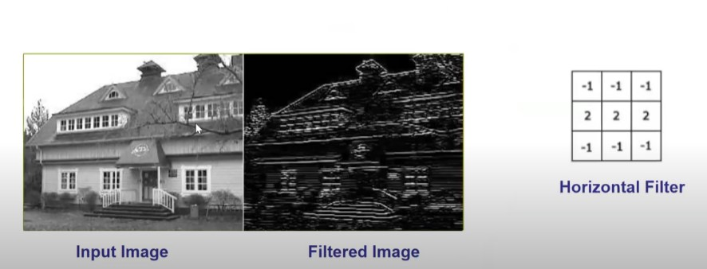
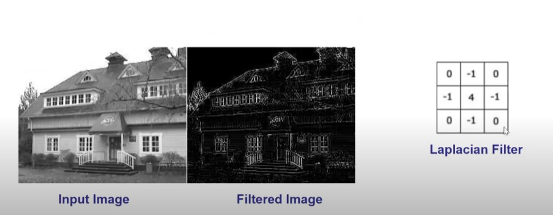
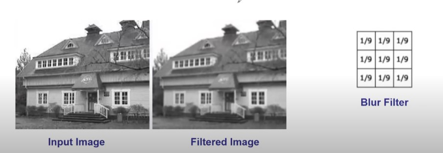

# 🧠 Tổng quát hóa – Convolutional Neural Network (CNN)


- Mạng nơron thần kinh tích chập sử dụng toán tử convolution để trích xuất đặc trưng hình ảnh.

`Image + Filters = Feature Maps`

- Cấu trúc CNN gồm các thành phần chính:

1. Feature maps: thu được thông qua các lớp convolution.

2. Pooling: gộp/tổng hợp đặc trưng để giảm kích thước và tăng tính khái quát.

3. Normalization: chuẩn hóa dữ liệu để tăng hiệu quả huấn luyện.

4. Phân loại: thực hiện qua các lớp Fully Connected (FC).

---
---

# Convolution (Cross-correlation) và Các Kernel Phổ Biến trong Computer Vision

Trong YOLO và hầu hết các CNN, "convolution" thực chất là **cross-correlation**:

$$
S(x, y) = \sum_m \sum_n I(x+m, y+n) \cdot K(m, n)
$$

- $I$: ảnh đầu vào  
- $K$: kernel (mặt nạ lọc, thường có kích thước 3x3 hoặc 5x5)  
- $S$: ảnh đầu ra  

---

## 1. Một số kernel phổ biến

### a) Laplacian (lọc biên toàn cục)

$$
K = \begin{bmatrix}
0 & -1 & 0 \\
-1 & 4 & -1 \\
0 & -1 & 0
\end{bmatrix}
$$

---

### b) Horizontal Filter (biên ngang)

$$
K = \begin{bmatrix}
-1 & -1 & -1 \\
2 & 2 & 2 \\
-1 & -1 & -1
\end{bmatrix}
$$

---

### c) Blur (làm mờ trung bình)

$$
K = \frac{1}{9} \begin{bmatrix}
1 & 1 & 1 \\
1 & 1 & 1 \\
1 & 1 & 1
\end{bmatrix}
$$

---

## 2. Ví dụ minh họa: Ma trận 5x5 lọc với kernel 3x3

Giả sử ảnh đầu vào:

$$
I = \begin{bmatrix}
1 & 2 & 3 & 4 & 5 \\
5 & 6 & 7 & 8 & 9 \\
9 & 8 & 7 & 6 & 5 \\
4 & 3 & 2 & 1 & 0 \\
0 & 1 & 2 & 3 & 4
\end{bmatrix}
$$

Chọn vị trí **pixel trung tâm $(x=2, y=2)$**, tức hàng 3, cột 3 (theo chỉ số 1-based).  
Vùng lân cận 3x3 quanh điểm này là:

$$
I_{local} = \begin{bmatrix}
6 & 7 & 8 \\
8 & 7 & 6 \\
3 & 2 & 1
\end{bmatrix}
$$

---



### a) Horizontal Filter (biên ngang)

Kernel:

$$
K = \begin{bmatrix}
-1 & -1 & -1 \\
2 & 2 & 2 \\
-1 & -1 & -1
\end{bmatrix}
$$

Tính:

$$
S_{edge}(2,2) = (6)(-1)+(7)(-1)+(8)(-1) \\
+ (8)(2)+(7)(2)+(6)(2) \\
+ (3)(-1)+(2)(-1)+(1)(-1)
$$

Kết quả:

$$
S_{edge}(2,2) = 15
$$

> **Ý nghĩa**: Giá trị dương lớn cho thấy có đường biên ngang mạnh tại vùng này.

---



### b) Laplacian (lọc biên toàn cục)

Kernel:

$$
K = \begin{bmatrix}
0 & -1 & 0 \\
-1 & 4 & -1 \\
0 & -1 & 0
\end{bmatrix}
$$

Tính:

$$
S_{lap}(2,2) = (7)(-1) + (8)(-1) + (8)(-1) + (6)(-1) + (7)(4)
$$

Kết quả:

$$
S_{lap}(2,2) = -7 -8 -8 -6 + 28 = -1
$$

> **Ý nghĩa**: Kết quả gần 0 → tại vị trí này không có biên rõ rệt theo Laplacian.

---



### c) Blur (làm mờ trung bình)

Kernel:

$$
K = \frac{1}{9} \begin{bmatrix}
1 & 1 & 1 \\
1 & 1 & 1 \\
1 & 1 & 1
\end{bmatrix}
$$

Tính trung bình 9 giá trị trong $I_{local}$:

$$
S_{blur}(2,2) = \frac{6+7+8+8+7+6+3+2+1}{9}
$$

Kết quả:

$$
S_{blur}(2,2) = \frac{48}{9} \approx 5.33
$$

> **Ý nghĩa**: Làm mờ → giá trị pixel trở thành trung bình, giúp giảm nhiễu.

---

## 3. Nhận xét

- **Edge Filter (custom)**: nhấn mạnh cạnh ngang, kết quả lớn (15).  
- **Laplacian**: bắt biên đa hướng, tại điểm này gần như không có biên rõ ($-1$).  
- **Blur**: làm mờ, pixel trung tâm thành giá trị trung bình ($5.33$).

👉 Ba bộ lọc cùng áp dụng trên một vùng, nhưng kết quả khác nhau hoàn toàn → cho thấy mỗi kernel "nhìn ảnh" theo một cách riêng để trích xuất đặc trưng.

---

## 3. Kết luận

- Convolution (cross-correlation) là phép nhân trượt kernel trên ảnh.  
- Các kernel phổ biến:  
  - **Laplacian** → nhấn mạnh biên toàn cục  
  - **Edge Filter (custom)** → phát hiện biên ngang rõ rệt  
  - **Blur** → làm mờ, giảm nhiễu  
- Ví dụ với ma trận 5x5 cho thấy cách tính cụ thể từng giá trị pixel sau khi lọc.

---

## 4. Pipeline: Ảnh gốc → Blur → Edge Filter

Trong thực tế, để **phát hiện biên** tốt hơn, ta không áp dụng trực tiếp Sobel hay Laplacian lên ảnh gốc, mà thường thêm bước **làm mờ (Blur)** trước.  

### Lý do:
- Ảnh gốc thường có **nhiễu (noise)**: pixel đơn lẻ sáng/tối bất thường.  
- Nếu áp ngay edge filter → nhiễu này cũng bị coi là "biên", tạo ra biên giả.  
- Blur kernel giúp **làm trơn (smooth)** cục bộ, giảm nhiễu, giữ lại cấu trúc lớn → biên thật được nhấn mạnh hơn.

---

### Pipeline cơ bản

$$
I_{edge} = (I * K_{blur}) * K_{edge}
$$

Trong đó:
- $I$: ảnh gốc  
- $K_{blur}$: kernel làm mờ (ví dụ trung bình 3x3)  
- $K_{edge}$: kernel biên (Sobel, Laplacian, hoặc custom)  

---

### Ví dụ minh họa

1. **Ảnh gốc**: có nhiều chi tiết và nhiễu.  
2. **Blur (3x3 mean filter)**: giảm nhiễu, làm mượt ảnh.  
3. **Edge Filter (ví dụ Laplacian)**: phát hiện biên rõ ràng, ít bị rối bởi nhiễu.

Kết quả:  
- Nếu bỏ bước Blur → biên xuất hiện cả ở vùng nhiễu (biên giả).  
- Nếu có Blur → biên chủ yếu ở vùng thay đổi thật sự (vật thể, contour).

---

### Minh họa toán học

## 4. Blur để giảm nhiễu trước khi Edge Detection  

### 1. Nhiễu ảnh là gì?  
Trong ảnh thật thường tồn tại **pixel nhiễu**:  
- Điểm sáng bất thường  
- Điểm tối bất thường  
- Dao động ngẫu nhiên về cường độ  

Ví dụ: trong ảnh xám 8-bit (0–255), vùng xung quanh có giá trị ~100–120, nhưng xuất hiện một pixel = 250 → đó là **nhiễu**.

---

### 2. Blur hoạt động như thế nào?  
Kernel làm mờ (ví dụ **mean filter 3x3**) lấy giá trị trung bình của các điểm lân cận:  

$$
I'(x,y) = \frac{1}{N} \sum_{i=-k}^{k} \sum_{j=-k}^{k} I(x+i, y+j)
$$  

Trong đó $N$ là số phần tử trong kernel (ví dụ 9 cho kernel 3x3).  

➡ Nếu có một pixel nhiễu (rất khác biệt so với hàng xóm), giá trị đó sẽ bị **pha loãng** trong phép trung bình → giảm tác động của nhiễu.  

---

### 3. Ví dụ minh họa  

Ảnh gốc 3x3 có một pixel nhiễu:  

$$
I = \begin{bmatrix}
100 & 102 & 101 \\
99 & 250 & 98 \\
100 & 101 & 99
\end{bmatrix}
$$  

- Pixel trung tâm = 250, rõ ràng bất thường (các giá trị khác chỉ quanh ~100).  
- Nếu không lọc, điểm này sẽ hiện lên như một chấm trắng chói.  

Áp dụng **mean blur 3x3**:  

$$
I'(1,1) = \frac{100+102+101+99+250+98+100+101+99}{9} = \frac{1050}{9} \approx 117
$$  

👉 Giá trị 250 đã bị “pha loãng”, giảm về ~117, gần hơn với bối cảnh (~100).  

---

### 4. Ý nghĩa trong edge detection  
- **Không làm mờ trước**: nhiễu tạo ra các biên giả khi dùng Sobel, Laplacian → ảnh bị rối, nhiều cạnh không thật.  
- **Có làm mờ trước**: nhiễu giảm, biên thật (contour) giữ lại rõ hơn → giúp Edge Detection ổn định và chính xác hơn.  


---

## 5. Tổng kết

- Pipeline chuẩn trong xử lý ảnh cổ điển:  
  **Ảnh gốc → Blur (giảm nhiễu) → Edge Filter (Sobel/Laplacian/custom)**  
- Blur đóng vai trò như "bộ lọc trước" để biên phát hiện ra **ít nhiễu, chính xác hơn**.

---
---


## 5. Kiến trúc CNN cơ bản: Conv → Pooling → Flatten → Fully Connected → Softmax

### 1. Convolution (Conv)
- Đã trình bày chi tiết ở phần trước (cross-correlation).
- **Giả sử** sau Conv (same padding) thu được feature map 5×5 (ví dụ với Horizontal Filter):

$$
S = \begin{bmatrix}
-5 & -6 & -3 & 0 & 1 \\
2 & 6 & 12 & 18 & 14 \\
16 & 21 & 15 & 9 & 4 \\
-4 & -9 & -15 & -21 & -16 \\
-5 & -3 & 6 & 15 & 13
\end{bmatrix}
$$

---

### 2. Pooling (ví dụ: Max Pooling, cửa sổ 2x2, stride = 2)
- Mục tiêu: giảm kích thước không gian, giữ đặc trưng mạnh nhất từng vùng.

Các vùng 2x2 (valid) và giá trị lớn nhất:
```lua
- Ô (1): hàng 1–2, cột 1–2  

[[-5, -6],
[ 2, 6]] → max = 6

- Ô (2): hàng 1–2, cột 3–4  
[[-3, 0],
[12, 18]] → max = 18

- Ô (3): hàng 3–4, cột 1–2  
[[16, 21],
[-4, -9]] → max = 21

- Ô (4): hàng 3–4, cột 3–4  
[[15, 9],
[-15, -21]] → max = 15

Kết quả Max Pooling (ma trận 2x2):

P = [[ 6, 18 ],
[21, 15 ]]
```

> Ghi chú: Với stride = 2 và kernel 2x2 trên đầu vào 5x5, phần rìa cuối không đủ cửa sổ nên bị bỏ qua

---

### 3. Flatten
- Chuyển $P \in \mathbb{R}^{2 \times 2}$ thành vector hàng $1 \times 4$ (theo thứ tự hàng–cột):

$$
x = \mathrm{Flatten}(P) = [\,6,\;18,\;21,\;15\,]
$$

---

### 4. Fully Connected (Dense Layer)
- Giả sử ta có 3 lớp đầu ra (3 classes).  
- Trọng số $W \in \mathbb{R}^{3 \times 4}$, bias $b \in \mathbb{R}^{3}$:

$$
W = \begin{bmatrix}
0.10 & 0.05 & 0.02 & 0.01 \\
0.05 & 0.02 & 0.01 & 0.04 \\
0.01 & 0.00 & 0.01 & 0.00
\end{bmatrix},\quad
b = \begin{bmatrix}
0.93 \\
-0.47 \\
-0.27
\end{bmatrix}
$$

Tính **logits** $z = W x^\top + b$:

$$
\begin{aligned}
z_1 &= 0.10\cdot 6 + 0.05\cdot 18 + 0.02\cdot 21 + 0.01\cdot 15 + 0.93 \\
    &= 0.60 + 0.90 + 0.42 + 0.15 + 0.93 = 3.00 \\[4pt]

z_2 &= 0.05\cdot 6 + 0.02\cdot 18 + 0.01\cdot 21 + 0.04\cdot 15 - 0.47 \\
    &= 0.30 + 0.36 + 0.21 + 0.60 - 0.47 = 1.00 \\[4pt]
    
z_3 &= 0.01\cdot 6 + 0.00\cdot 18 + 0.01\cdot 21 + 0.00\cdot 15 - 0.27 \\
    &= 0.06 + 0 + 0.21 + 0 - 0.27 = 0.00
\end{aligned}
$$

Vậy:

$$
z = [\,3,\;1,\;0\,]
$$

---

### 5. Softmax (Output Layer)
- Chuyển logits thành xác suất:

$$
\mathrm{Softmax}(z_i) = \frac{e^{z_i}}{\sum_{j=1}^{C} e^{z_j}}, \quad C=3
$$

Tính trực tiếp:

$$
e^{3}=20.0855,\; e^{1}=2.7183,\; e^{0}=1.0000 \\
\Rightarrow \sum = 23.8038
$$

Xác suất:

$$
p = \left[\frac{20.0855}{23.8038},\; \frac{2.7183}{23.8038},\; \frac{1.0000}{23.8038}\right]
\approx [\,0.8438,\;0.1142,\;0.0420\,]
$$

> Gợi ý tính ổn định số: trừ $\max(z)=3$ trước khi mũ hoá  
> $z'=[0,-2,-3] \Rightarrow e^{z'}=[1,0.1353,0.0498],\; \sum=1.1851$  
> $p=[1/1.1851,\;0.1353/1.1851,\;0.0498/1.1851] \approx [0.8438,0.1142,0.0420]$.

---

✅ **Chuỗi xử lý đầy đủ (ví dụ số học):**  
**Conv (ra $5\times5$ S)** → **MaxPool $2\times2$ (ra $2\times2$ P)** → **Flatten ($x=[6,18,21,15]$)** → **FC ($z=[3,1,0]$)** → **Softmax ($p\approx[0.844,0.114,0.042]$)**

