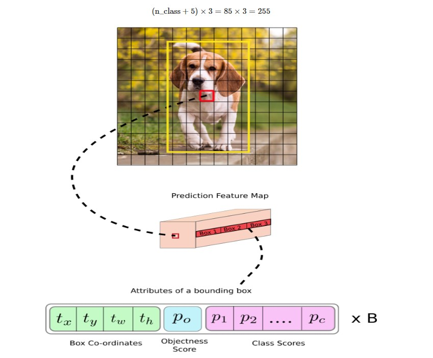
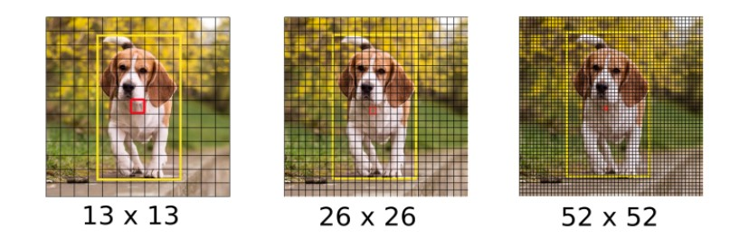

# 📍 Vị trí không gian trong Object Detection (YOLO)

Hình minh họa cho thấy cách mô hình object detection (như **YOLO**) sử dụng thông tin **vị trí không gian** để phát hiện đối tượng.

---

## 1. Grid trên ảnh
- Ảnh được chia thành một **lưới (grid)**, ví dụ 13×13 hoặc 19×19 (tùy kích thước ảnh và kiến trúc).  
- Mỗi **ô lưới** đại diện cho một vùng không gian cụ thể trong ảnh gốc.  
- Mỗi ô có thể dự đoán **một hoặc nhiều bounding box** nếu phát hiện có đối tượng trong vùng đó.  

> Đây là cách mô hình **giữ lại thông tin không gian**: mỗi ô biết mình đang “nhìn” vào vùng nào của ảnh.

---

## 2. Bounding Box (Hộp giới hạn)
- **Hộp vàng**: bounding box chính xác mà mô hình dự đoán, bao quanh toàn bộ đối tượng.  
- **Hộp đỏ**: có thể là một dự đoán chưa chính xác hoặc một **anchor box** trong quá trình huấn luyện.  

Bounding box được biểu diễn bằng **4 tham số**:

- $$t_x, t_y$$ : vị trí tâm hộp (tương đối với ô lưới)  
- $$t_w, t_h$$ : chiều rộng và chiều cao (tương đối với ảnh hoặc anchor box)

---

## 3. Prediction Feature Map
Đây là **tensor đầu ra** của mô hình sau khi ảnh đi qua **Backbone + Neck**.

- Mỗi **cell trong feature map** tương ứng với một ô lưới trong ảnh gốc.  
- Mỗi cell dự đoán:  
  - **Box Coordinates**: $$t_x, t_y, t_w, t_h$$  
  - **Objectness Score**: $$p_o$$ → độ tin cậy có đối tượng  
  - **Class Scores**: $$p_1, p_2, ..., p_c$$ → xác suất thuộc từng lớp  

👉 Tất cả các thông tin này đều **gắn với vị trí không gian** của cell tương ứng.

---

## 4. Tính toán vị trí bounding box thực tế

Tọa độ thực tế của bounding box được tính từ các giá trị dự đoán như sau:

$$
b_x = \sigma(t_x) + c_x
$$  

$$
b_y = \sigma(t_y) + c_y
$$  

$$
b_w = p_w \cdot e^{t_w}
$$  

$$
b_h = p_h \cdot e^{t_h}
$$  

Trong đó:
- $$(c_x, c_y)$$ : tọa độ gốc của cell trong grid  
- $$\sigma$$ : hàm sigmoid để chuẩn hóa (giữ trong khoảng (0,1))  
- $$(p_w, p_h)$$ : kích thước anchor box được gán cho cell đó  

---

### 📐 Ví dụ minh họa

Giả sử:
- Ảnh đầu vào: **416×416**  
- Feature map: **13×13** (mỗi cell tương ứng vùng **32×32 pixel**)  
- Ta xét 1 cell ở hàng 5, cột 7 → gốc tọa độ cell là $$(c_x, c_y) = (7, 5)$$  

Mạng dự đoán cho cell này:
- $$t_x = 0.4,\ \ t_y = 0.7$$  
- $$t_w = 0.5,\ \ t_h = -0.3$$  
- Anchor box gán: $$(p_w, p_h) = (100, 80)$$  

---

### 👉 Tính toán

1. **Tâm hộp (x,y)**  

$$
b_x = \sigma(0.4) + 7 \approx 0.598 + 7 = 7.598
$$  

$$
b_y = \sigma(0.7) + 5 \approx 0.668 + 5 = 5.668
$$  

→ Tâm hộp nằm ở vị trí **(7.598, 5.668)** trong lưới 13×13.

Quy đổi sang pixel trên ảnh (mỗi cell = 32px):  

$$
X = 7.598 \times 32 \approx 243\ \text{px}
$$  

$$
Y = 5.668 \times 32 \approx 181\ \text{px}
$$  

---

2. **Chiều rộng & chiều cao** 

$$
b_w = 100 \cdot e^{0.5} \approx 100 \cdot 1.648 = 164.8
$$  

$$
b_h = 80 \cdot e^{-0.3} \approx 80 \cdot 0.741 = 59.3
$$  

---

### ✅ Kết quả
- Bounding box có tâm tại **(243px, 181px)**  
- Kích thước hộp: **164.8 × 59.3 px**  

👉 Đây là cách từ **output của feature map** suy ra được vị trí thực tế của hộp trên ảnh gốc.

---

## 📐 Các kích thước Feature Map: 13×13, 26×26, 52×52

Khi ảnh đầu vào (ví dụ **416×416**) đi qua mạng CNN, nó được giảm kích thước dần qua các lớp convolution và pooling.  
Kết quả là ta thu được **các feature map** có kích thước nhỏ hơn:

| Feature Map | Dự đoán cho    | Đặc điểm |
|-------------|----------------|----------|
| 13×13       | Vật thể lớn    | Nhìn tổng thể, ít chi tiết |
| 26×26       | Vật thể vừa    | Cân bằng giữa chi tiết và tổng thể |
| 52×52       | Vật thể nhỏ    | Nhìn chi tiết, độ phân giải cao |

---

### 🎯 Tại sao cần nhiều feature map?
- Vật thể nhỏ (ví dụ: cái ly, con mèo con) → rất khó phát hiện nếu chỉ dùng feature map 13×13.  
- Vật thể lớn (ví dụ: ô tô, con người) → không cần độ chi tiết quá cao.  

👉 Vì vậy, **YOLOv3 và các phiên bản sau** dùng **3 feature map song song** để:
- Dự đoán vật thể ở nhiều kích thước khác nhau.  
- Tăng độ chính xác tổng thể.  

---

### 📦 Mỗi feature map có bao nhiêu ô dự đoán?
Với mỗi feature map, **mỗi ô (cell)** sẽ dự đoán **3 anchor boxes**.  

Tổng số dự đoán trên một ảnh là:

$$
(13 \times 13 + 26 \times 26 + 52 \times 52) \times 3 = 10647 \ \text{bounding boxes}
$$

→ Mỗi ảnh sẽ sinh ra **hơn 10,000 hộp dự đoán**! Sau đó, thuật toán **Non-Max Suppression (NMS)** được dùng để lọc ra các hộp tốt nhất.

---

## 🧠 Tổng kết

| Kích thước | Dự đoán cho   | Số ô (cells) | Số anchor box |
|------------|---------------|--------------|---------------|
| 13×13      | Vật thể lớn   | 169          | 507           |
| 26×26      | Vật thể vừa   | 676          | 2028          |
| 52×52      | Vật thể nhỏ   | 2704         | 8112          |
| **Tổng**   | —             | 3549         | **10647**     |

➡️ Nhờ kết hợp **nhiều tỉ lệ feature map** và **anchor boxes**, YOLO có khả năng phát hiện **đa dạng kích thước vật thể** trong cùng một bức ảnh.
