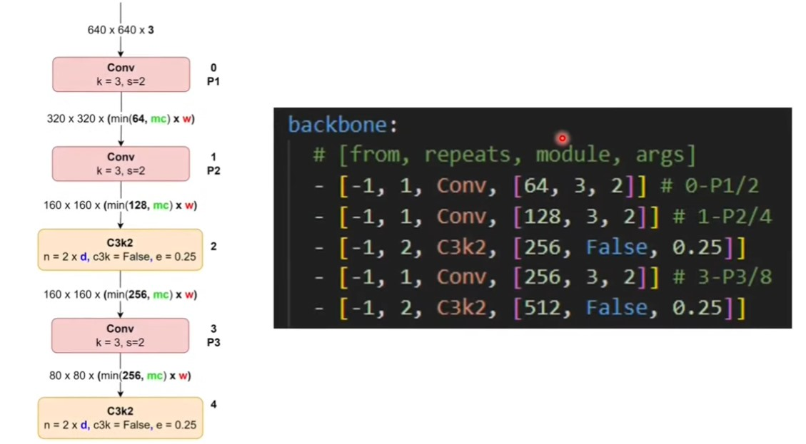

---

# 🧠 Cấu hình Backbone của CNN

```yaml
backbone:
# [from, repeats, module, args]
- [-1, 1, Conv, [64, 3, 2]]      # 0 - P1/2
- [-1, 1, Conv, [128, 3, 2]]     # 1 - P2/4
- [-1, 3, C3k2, [256, False]]    # 2
- [-1, 3, C3k2, [512, False, 0.25]] # 3
```

## 1. Ý nghĩa chung

* Mỗi dòng trong backbone là một **block** (khối xử lý) trong mạng.
* Cú pháp:

  ```
  [from, repeats, module, args]
  ```

  * **from**: Lấy đầu vào từ tầng nào (ở đây `-1` tức là lấy từ ngay tầng trước).
  * **repeats**: Lặp lại module bao nhiêu lần.
  * **module**: Loại block sử dụng (Conv, C3k2, …).
  * **args**: Tham số truyền vào module (số kênh, kernel, stride, shortcut, scaling, …).

---

## 2. Phân tích từng dòng

### Dòng 1

```yaml
- [-1, 1, Conv, [64, 3, 2]]   # 0 - P1/2
```

* Từ output trước (`-1`).
* Dùng **Conv** với:

  * **64** kênh đầu ra.
  * **kernel = 3**, **stride = 2** → giảm kích thước không gian (downsampling ×2).
* Đây tạo ra feature map **P1/2**:

  * `/2` nghĩa là giảm 1/2 kích thước ảnh so với input gốc.

---

### Dòng 2

```yaml
- [-1, 1, Conv, [128, 3, 2]]  # 1 - P2/4
```

* Conv tiếp theo, ra **128 kênh**.
* `stride=2` → tiếp tục giảm kích thước.
* Đây tạo ra **P2/4**: kích thước nhỏ đi **1/4** so với input ban đầu.

---

### Dòng 3

[Tài liệu C3k2](../../yolo11/c3k2.md)

```yaml
- [-1, 3, C3k2, [256, False]]   # 2
```

* Module **C3k2**, lặp lại **3 lần**.
* Output có **256 kênh**.
* **False** = không dùng shortcut (skip connection).
* `C3k2` thường là module có nhiều nhánh conv + concat lại → trích đặc trưng tốt hơn so với conv thường.

---

### Dòng 4

```yaml
- [-1, 3, C3k2, [512, False, 0.25]]   # 3
```

* Cũng là **C3k2**, lặp lại **3 lần**.
* Output **512 kênh**.
* Không dùng shortcut.
* Có thêm tham số **0.25** → thường là *scaling factor* (giảm bớt số kênh bên trong để tiết kiệm tính toán).

---

## 3. 📊 Liên hệ với FPN (Feature Pyramid Network)

* Các tầng Conv giảm dần kích thước feature map nhưng tăng số kênh:

  * **P1/2** → nhỏ hơn input 2 lần, 64 kênh.
  * **P2/4** → nhỏ hơn input 4 lần, 128 kênh.
  * **P3** (sau C3k2) → nhỏ hơn input 4 lần nhưng giàu đặc trưng hơn, 256 kênh.
  * **P4** (sau C3k2 tiếp theo) → nhỏ hơn input 8 lần, 512 kênh.
* Đây chính là cách CNN xây dựng **Feature Pyramid**: mỗi tầng chứa thông tin ở mức độ trừu tượng khác nhau.

---

✅ Tóm gọn:

* `Conv (k, s)` = khối cơ bản để giảm kích thước và tăng chiều sâu đặc trưng.
* `C3k2` = khối phức tạp (có nhiều conv + concat) để trích xuất đặc trưng mạnh hơn.
* `stride=2` = downsample.
* `shortcut=False` = bỏ residual.
* `0.25` = hệ số giảm số kênh bên trong module.

---

Bạn có muốn mình vẽ thêm **sơ đồ ASCII** minh họa dòng chảy dữ liệu (P1 → P4) để dễ hình dung không?

# 🧩 Ví dụ minh họa với ảnh 4×4

Giả sử input ban đầu là ma trận 4×4:

```
I (4x4):
1  2  3  4
5  6  7  8
9 10 11 12
13 14 15 16
```
## Công thức tính 
```lua
Output = (Input + 2*padding - kernel_size) // stride + 1
```

---

## Bước 1: Conv \[64, 3, 2]  → P1/2

* Kernel 3×3, stride=2.
* Ảnh 4×4 → còn **2×2** (downsample /2).
* Số kênh tăng từ 1 → 64.

Ví dụ (chỉ minh họa 1 kênh để dễ hình dung):

```
P1/2 (2x2):
6   8
14 16
```

(Tính bằng cách lấy max/giá trị trung tâm từ patch 3×3 – minh họa đơn giản, thực tế có tích chập và cộng bias).

---

## Bước 2: Conv \[128, 3, 2] → P2/4

* Input 2×2, stride=2 → còn **1×1**.
* Kênh tăng: 64 → 128.

```
P2/4 (1x1):
[42]   (128 kênh nhưng minh họa 1 giá trị)
```

---

## Bước 3: C3k2 \[256, False], repeat=3 → P3

* Module C3k2 phức tạp hơn conv: tách thành nhiều nhánh conv 1×1, 3×3 rồi concat lại.
* Output kích thước vẫn **1×1**, nhưng số kênh: **128 → 256**.

```
P3 (1x1):
[85]  (giả sử sau các nhánh conv, concat và fuse lại)
```

---

## Bước 4: C3k2 \[512, False, 0.25], repeat=3 → P4

* Tiếp tục trích đặc trưng, giữ kích thước 1×1.
* Kênh tăng: 256 → 512.
* Hệ số 0.25 giúp giảm tính toán bên trong block.

```
P4 (1x1):
[170]  (512 kênh)
```

---

# 📊 Tổng kết kiến trúc với input 4×4

* **Input (4×4×1)**
* → **P1/2: 2×2×64**
* → **P2/4: 1×1×128**
* → **P3: 1×1×256**
* → **P4: 1×1×512**
