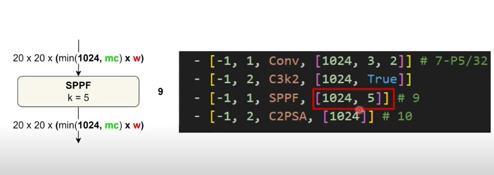

# 🔄 Luồng xử lý sau C3k2 → SPPF



### 1. Đầu vào sau **C3k2**

* Giả sử input ban đầu khối này có kích thước không gian **20 × 20** (do đã downsample nhiều lần từ ảnh gốc 640).
* Sau **C3k2 \[1024, True]**, tensor giữ nguyên kích thước không gian:

```
20 × 20 × 1024
```

* Tức: H × W = 20 × 20, Depth = 1024 kênh.

---

### 2. Vào **SPPF \[1024, 5]**

* **SPPF = Spatial Pyramid Pooling – Fast**.
* Ý tưởng: thay vì nhiều pooling với kernel 5, 9, 13 (như SPP gốc), SPPF chỉ cần **một kernel 5**, rồi lặp maxpool 3 lần liên tiếp để mô phỏng receptive field lớn hơn.

Ví dụ:

```
Input → MaxPool(k=5, s=1) → MaxPool(k=5, s=1) → MaxPool(k=5, s=1)
```

* Kích thước không gian vẫn **20 × 20** (stride=1).
* Sau đó, các tensor được **concat** lại theo chiều kênh, rồi nén về **1024 kênh** bằng conv 1×1.

---

### 3. Đầu ra của **SPPF**

* Vẫn giữ spatial size:

```
20 × 20
```

* Số kênh vẫn:

```
1024
```

* Nhưng khác biệt là: đặc trưng ở đây có **receptive field rộng hơn nhiều** → tức là một neuron "thấy" nhiều vùng lớn trong ảnh, không chỉ local patch 3×3.

---

# 📊 Tóm tắt pipeline

```
Input (20×20×1024)
   ↓ C3k2 [1024, True]
Tensor (20×20×1024)
   ↓ SPPF [1024, 5]
Tensor (20×20×1024, receptive field ↑)
```

---
🧠 Ý nghĩa khi ghép C3k2 → SPPF

C3k2: trích xuất chi tiết, mô hình hóa quan hệ local.

SPPF: bổ sung thêm toàn cục (global context).

👉 Ghép lại: mô hình vừa học được chi tiết nhỏ, vừa không bỏ sót bối cảnh lớn.

Ví dụ hình dung:

- C3k2 = bạn nhìn một ô cửa sổ, thấy chi tiết viền, khung, kính.

- SPPF = bạn lùi lại nhìn cả ngôi nhà, biết cửa sổ nằm trong đâu.
---

---

## 🔎 Code phân tích

```python
class SPPF(nn.Module):
    def __init__(self, c1: int, c2: int, k: int = 5):
        super().__init__()
        c_ = c1 // 2               # 1. Ẩn: giảm kênh còn 1/2
        self.cv1 = Conv(c1, c_, 1, 1)   # 2. Conv 1x1: giảm kênh
        self.cv2 = Conv(c_ * 4, c2, 1, 1)  # 4. Conv 1x1: gom lại
        self.m = nn.MaxPool2d(kernel_size=k, stride=1, padding=k // 2)  # 3. MaxPool kxk
```

---

## 📐 Dòng chảy dữ liệu (forward) 

⚡ **[Đọc thêm về cách tính ](../EX/Receptive_field.md)**

Giả sử **Input = \[N, 1024, 20, 20]** (batch N, 1024 kênh, kích thước 20×20):

1. **Giảm kênh**

```
x1 = cv1(x) → [N, 512, 20, 20]
```

2. **Áp 3 lần MaxPool2D**

* Pool 1: m(x1) → \[N, 512, 20, 20]
* Pool 2: m(m(x1)) → \[N, 512, 20, 20]
* Pool 3: m(m(m(x1))) → \[N, 512, 20, 20]

3. **Concat lại theo channel**

```
cat = torch.cat([x1, m1, m2, m3], dim=1)
→ [N, 512*4, 20, 20] = [N, 2048, 20, 20]
```

4. **Conv 1x1 gom lại thành c2**

```
out = cv2(cat) → [N, 1024, 20, 20]
```

---

## ✅ Ý nghĩa đầu ra

* **Không đổi kích thước không gian**: vẫn 20×20.
* **Giữ nguyên số kênh theo cấu hình (c2 = 1024)**.
* **Mở rộng receptive field** nhờ 3 lần MaxPooling lồng nhau, nhưng tiết kiệm hơn SPP thường.

👉 Nói gọn: **Input \[N, 1024, 20, 20] → Output \[N, 1024, 20, 20]**, nhưng biểu diễn mạnh hơn, nắm được bối cảnh rộng hơn.

---
