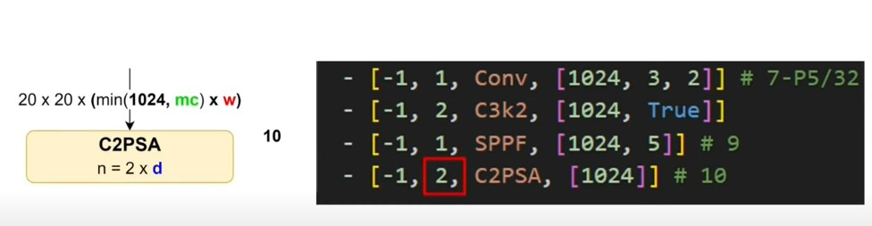

# 🔄 Luồng xử lý từ SPPF → C2PSA trong YOLOv11



## 1. Đầu ra từ **SPPF [1024, 5]**
- **Kích thước không gian**: Vẫn là **20x20**.
- **Số kênh**: **1024 kênh**.
- **Hình dạng tensor**: `[N, 1024, 20, 20]`.
- **Đặc điểm**: Đặc trưng đã được tăng cường với **receptive field rộng hơn** nhờ 3 lần max pooling trong SPPF.

---

## 2. Vào **C2PSA [c1=1024, c2=1024, n=1, e=0.5]**
- **C2PSA** trong YOLOv11 là một khối tối ưu hóa, sử dụng **PSA (Partial Self-Attention)** để kết hợp hiệu quả giữa đặc trưng cục bộ và toàn cục.
- **Tham số**:
  - `c1`: Số kênh đầu vào (1024, khớp với đầu ra của SPPF).
  - `c2`: Số kênh đầu ra (1024, giữ nguyên số kênh).
  - `n`: Số lượng `PSABlock` (mặc định là 1).
  - `e`: Tỷ lệ mở rộng (mặc định là 0.5, tức giảm số kênh xuống một nửa trong nhánh chính).
- **Cấu trúc** (dựa trên `__init__`):
  1. `self.c = int(c1 * e)`: Số kênh trung gian, với `e=0.5`, nên `self.c = int(1024 * 0.5) = 512`.
  2. `self.cv1 = Conv(c1, 2 * self.c, 1, 1)`: Conv 1x1 tăng số kênh từ 1024 lên `2 * 512 = 1024`.
  3. `self.cv2 = Conv(2 * self.c, c1, 1)`: Conv 1x1 nén lại từ 1024 về 1024.
  4. `self.m`: Một `nn.Sequential` chứa `n` khối `PSABlock`, mỗi khối có:
     - `attn_ratio=0.5`: Tỷ lệ kích thước Query/Key so với Value.
     - `num_heads=self.c // 64`: Số head trong multi-head attention, với `self.c = 512`, nên `num_heads = 512 // 64 = 8`.

### Ý nghĩa của PSABlock
- `PSABlock` là một biến thể của self-attention, được thiết kế để giảm chi phí tính toán so với attention thông thường, đồng thời giữ khả năng mô hình hóa quan hệ không gian.
- Với `attn_ratio=0.5` và `num_heads=8`, mỗi head xử lý một phần đặc trưng, tập trung vào các mối quan hệ quan trọng trong không gian 20x20.

---

## 3. Đầu ra của **C2PSA**
- **Kích thước không gian**: Vẫn là **20x20**, vì các phép biến đổi (Conv 1x1, attention) không thay đổi kích thước không gian.
- **Số kênh**: Vẫn là **1024**, như được định nghĩa trong `c2`.
- **Hình dạng tensor**: `[N, 1024, 20, 20]`.
- **Đặc điểm**: Đặc trưng được tinh chỉnh với **partial self-attention**, giúp mô hình tập trung vào các vùng quan trọng trong không gian mà không tăng quá mức chi phí tính toán.

---

# 📊 Tóm tắt pipeline từ SPPF → C2PSA
```
Input (20×20×1024)
   ↓ SPPF [1024, 5]
Tensor (20×20×1024, receptive field ↑)
   ↓ C2PSA [1024, 1024, n=1, e=0.5]
Tensor (20×20×1024, với partial self-attention)
```

---

# 🧠 Ý nghĩa khi ghép SPPF → C2PSA
- **SPPF**: Cung cấp **bối cảnh toàn cục** bằng cách mở rộng receptive field, giúp mô hình "nhìn" toàn bộ vùng ảnh.
- **C2PSA**: Tinh chỉnh đặc trưng với **partial self-attention**, tập trung vào các vùng quan trọng (như đối tượng) mà vẫn giữ hiệu quả tính toán nhờ `attn_ratio=0.5` và số head giới hạn.
- **Kết hợp**: SPPF mang lại cái nhìn rộng, C2PSA tăng cường khả năng tập trung vào chi tiết quan trọng, tối ưu cho việc phát hiện đối tượng.

Ví dụ hình dung:
- SPPF = "Nhìn toàn cảnh ngôi nhà để định vị cửa sổ."
- C2PSA = "Chú ý kỹ vào cửa sổ, tập trung vào các chi tiết quan trọng như khung hoặc kính, nhưng không quá tốn tài nguyên."

---

# 🔎 Phân tích code và dòng chảy dữ liệu

### `__init__`
```python
def __init__(self, c1: int, c2: int, n: int = 1, e: float = 0.5):
    super().__init__()
    assert c1 == c2  # Đảm bảo số kênh vào = số kênh ra
    self.c = int(c1 * e)  # Số kênh trung gian (1024 * 0.5 = 512)
    self.cv1 = Conv(c1, 2 * self.c, 1, 1)  # Tăng kênh lên 1024
    self.cv2 = Conv(2 * self.c, c1, 1)  # Nén lại về 1024
    self.m = nn.Sequential(*(PSABlock(self.c, attn_ratio=0.5, num_heads=self.c // 64) for _ in range(n)))
```

### `forward`
```python
def forward(self, x: torch.Tensor) -> torch.Tensor:
    a, b = self.cv1(x).split((self.c, self.c), dim=1)  # Chia thành [N, 512, 20, 20] và [N, 512, 20, 20]
    b = self.m(b)  # Xử lý nhánh b qua PSABlock
    return self.cv2(torch.cat((a, b), 1))  # Concat và nén lại [N, 1024, 20, 20]
```

### Dòng chảy dữ liệu
- **Input**: `[N, 1024, 20, 20]` (từ SPPF).
- **Bước 1**: `cv1(x)` → `[N, 1024, 20, 20]`, sau đó `split` thành:
  - `a`: `[N, 512, 20, 20]` (nhánh giữ nguyên).
  - `b`: `[N, 512, 20, 20]` (nhánh đi qua PSABlock).
- **Bước 2**: `self.m(b)` → `[N, 512, 20, 20]`, xử lý qua 1 `PSABlock` với attention.
- **Bước 3**: `torch.cat((a, b), 1)` → `[N, 1024, 20, 20]`.
- **Bước 4**: `cv2(...)` → `[N, 1024, 20, 20]` (đầu ra cuối cùng).

---

# ✅ Ý nghĩa đầu ra
- **Kích thước không gian**: Vẫn **20x20**.
- **Số kênh**: Vẫn **1024**.
- **Cải tiến**: Thêm **partial self-attention** qua `PSABlock`, giúp mô hình tập trung vào các vùng quan trọng với chi phí tính toán tối ưu.

---

# 💡 Ghi chú thêm
- Mã nguồn mới phản ánh thiết kế nhẹ nhàng hơn của YOLOv11, tập trung vào hiệu quả với `n=1` và `e=0.5`.
- Kết quả sau C2PSA có thể đi vào các khối tiếp theo (như đầu ra hoặc lớp detect).

