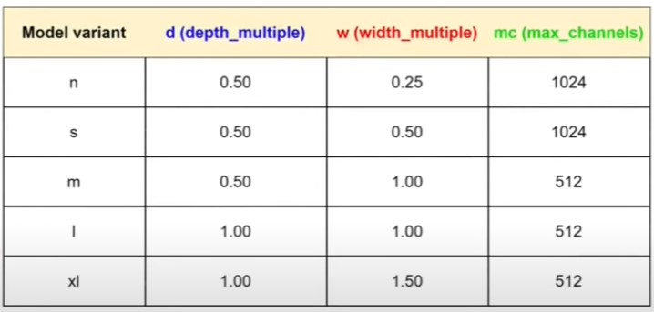

# 📊 Ý nghĩa các cột trong bảng cấu hình YOLOv11

## 1. Các cột trong bảng
- **Model variant**: Tên biến thể của mô hình YOLOv11 (`n, s, m, l, xl`).  
  - `n` = nano (rất nhẹ)  
  - `s` = small (nhỏ)  
  - `m` = medium (trung bình)  
  - `l` = large (lớn)  
  - `xl` = extra large (rất lớn)

- **d (depth\_multiple)**: Hệ số nhân cho **số lượng tầng** (layer/block) trong backbone.  
  - Ví dụ: `d = 0.5` → số tầng chỉ còn **một nửa** so với bản gốc.

- **w (width\_multiple)**: Hệ số nhân cho **số lượng kênh (channel)** trong mỗi tầng.  
  - Ví dụ: `w = 0.25` → số kênh giảm xuống **25%** so với bản gốc.

- **mc (max\_channels)**: Giới hạn **số kênh tối đa** trong backbone, không vượt quá giá trị này dù `w` có lớn đến đâu.

---

## 2. Ví dụ minh họa

- **YOLOv11-n**  
  - `depth_multiple = 0.50` → số tầng giảm **một nửa**  
  - `width_multiple = 0.25` → số kênh giảm còn **25%**  
  - `max_channels = 1024` → số kênh tối đa không vượt quá **1024**

- **YOLOv11-xl**  
  - `depth_multiple = 1.00` → số tầng giữ **nguyên bản gốc**  
  - `width_multiple = 1.50` → số kênh tăng lên **150%**  
  - `max_channels = 512` → số kênh tối đa giới hạn ở **512**

---

## 3. Tại sao cần nhiều biến thể?

- **Nhẹ (n, s):** tối ưu cho thiết bị di động, IoT, chạy nhanh với ít tài nguyên.  
- **Mạnh (m, l, xl):** dùng cho server, GPU, cần độ chính xác cao hơn.  

👉 Điều này cho phép người dùng **cân bằng giữa tốc độ và độ chính xác** theo nhu cầu thực tế.

---

## 4. Bảng cấu hình các biến thể YOLOv11

| Model variant | d (depth\_multiple) | w (width\_multiple) | mc (max\_channels) |
|---------------|----------------------|----------------------|---------------------|
| n             | 0.50                 | 0.25                 | 1024                |
| s             | 0.50                 | 0.50                 | 1024                |
| m             | 0.50                 | 1.00                 | 512                 |
| l             | 1.00                 | 1.00                 | 512                 |
| xl            | 1.00                 | 1.50                 | 512                 |

---

# ✅ Tóm tắt

- `depth_multiple (d)` → điều chỉnh **số tầng**.  
- `width_multiple (w)` → điều chỉnh **số kênh**.  
- `max_channels (mc)` → đặt **giới hạn kênh tối đa**.  
- `n, s, m, l, xl` → các biến thể mô hình cho **thiết bị khác nhau**, từ nhẹ đến mạnh.


---
---

# 🔎 Ví dụ minh họa `depth_multiple`, `width_multiple`, `max_channels`

## 1. Mạng gốc (baseline)
Giả sử backbone ban đầu có:
- **4 block** (tầng) → tương ứng với `depth = 4`
- Mỗi block có **[64, 128, 256, 512] kênh**

Biểu diễn đơn giản:

```lua
Block1: 64 kênh
Block2: 128 kênh
Block3: 256 kênh
Block4: 512 kênh
```

---

## 2. Trường hợp YOLOv11-n
- `depth_multiple = 0.5` → số block chỉ còn **4 × 0.5 = 2 block**  
- `width_multiple = 0.25` → số kênh giảm còn **25%**  
- `max_channels = 1024` → không ảnh hưởng vì kênh nhỏ hơn 1024  

Kết quả:

```lua
Block1: 64 × 0.25 = 16 kênh
Block2: 128 × 0.25 = 32 kênh
```

👉 Backbone chỉ còn **2 tầng**, rất nhẹ.

---

## 3. Trường hợp YOLOv11-xl
- `depth_multiple = 1.0` → số block giữ nguyên **4 block**  
- `width_multiple = 1.5` → số kênh tăng 150%  
- `max_channels = 512` → kênh không vượt quá 512  

Tính toán kênh mới:
- Block1: 64 × 1.5 = 96  
- Block2: 128 × 1.5 = 192  
- Block3: 256 × 1.5 = 384  
- Block4: 512 × 1.5 = 768 nhưng **bị giới hạn bởi max_channels = 512**  

Kết quả:

```lua
Block1: 96 kênh
Block2: 192 kênh
Block3: 384 kênh
Block4: 512 kênh (bị giới hạn bởi max_channels)
```

👉 Backbone vẫn đủ **4 tầng**, nhưng kênh nhiều hơn, mạnh hơn.

---

## 4. So sánh trực quan

| Biến thể    | Số block (theo d) | Số kênh (theo w, mc)                  |
|-------------|-------------------|----------------------------------------|
| Baseline    | 4                 | [64, 128, 256, 512]                   |
| YOLOv11-n   | 2                 | [16, 32]                              |
| YOLOv11-xl  | 4                 | [96, 192, 384, 512 (giới hạn)]        |

---

# ✅ Kết luận
- `depth_multiple (d)` → quyết định **số tầng** (block).  
- `width_multiple (w)` → quyết định **số kênh** trong mỗi tầng.  
- `max_channels (mc)` → đặt **trần giới hạn**, không cho số kênh vượt quá mức này.
