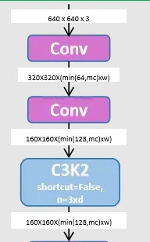

# 📌 C3 và C3K2 trong Backbone YOLOv11

---

## 1️⃣ C3 là gì?  
**C3 (Cross Stage Partial with 3 convolutions)** – block chuẩn trong YOLOv5–YOLOv8.  
Dựa trên ý tưởng **CSPNet**, gồm:  

- **Nhánh 1 (skip connection nhẹ):** cho phép gradient đi thẳng, không bị nghẽn.  
- **Nhánh 2 (xử lý sâu):** gồm nhiều bottleneck (1×1 → 3×3 → 1×1).  
- **Ghép (fusion):** trộn hai nhánh lại → vừa giữ đặc trưng thô, vừa thêm đặc trưng phức tạp.  

👉 Ưu điểm: cân bằng giữa **độ chính xác** và **tốc độ**.

---

## 2️⃣ Vậy “K2” là gì?  
**K2 = Kernel Interaction Level 2 (Kernel 2-stage).**  
Ý tưởng: thay đổi cách dùng kernel trong C3 để **mở rộng receptive field** mà không tăng nhiều FLOPs.  

Cách triển khai K2:  
- Stack nhiều conv 3×3 liên tiếp (mở rộng receptive field).  
- Dùng **dilated conv** (giãn khoảng lấy mẫu, nhìn xa hơn).  
- Multi-kernel fusion (kết hợp 3×3, 5×5, 7×7).  

👉 Nói nôm na: **K2 = chế kernel để mô hình nhìn rộng hơn trong cùng một bước** → không cần tăng thêm nhiều block C3.

---

## 3️⃣ C3K2 trong Backbone YOLOv11  

🎯 **Mục tiêu:**  
- Mở rộng receptive field sớm → phát hiện vật thể nhỏ tốt hơn.  
- Tăng hiệu quả trích xuất đặc trưng → ít tính toán dư thừa, phù hợp real-time.  
- Giữ gradient flow mượt nhờ nhánh skip + CSP.  
- Tái sử dụng đặc trưng qua nhiều bottleneck nhưng vẫn kiểm soát FLOPs/params.  

👉 Hình dung: **C3K2 giống như thay “ống kính góc rộng” cho C3.**  
Cùng một bước, mô hình nhìn xa hơn, gom ngữ cảnh nhiều hơn mà không đội chi phí quá cao.

---

## 4️⃣ Cấu trúc khái niệm (đơn giản hoá)  

- **Nhánh 1 (skip nhẹ):** truyền đặc trưng thô, giữ gradient ổn.  
- **Nhánh 2 (xử lý sâu):** nhiều conv/bottleneck với K2 kernel (mở rộng receptive field).  
- **Ghép đặc trưng:** trộn Nhánh 1 và Nhánh 2 để có đặc trưng phong phú hơn.  

---

## 5️⃣ So sánh trực quan: C3 vs C3K2  

| Đặc điểm              | C3 (chuẩn)       | C3K2 (YOLOv11)                 |
|------------------------|------------------|--------------------------------|
| **Kernel**            | 1×1, 3×3         | K2-modified (stacked, dilated, multi-kernel) |
| **Receptive field**   | Nhỏ hơn          | Rộng hơn (nhìn xa hơn)         |
| **Gradient flow**     | Có skip          | Có skip (giữ ổn)               |
| **Chi phí tính toán** | Thấp             | Gần như tương đương, hiệu quả hơn |
| **Phát hiện vật thể** | Vừa              | Tốt hơn, đặc biệt với vật thể nhỏ |

👉 **Tóm lại:**  
- **C3** = block backbone chuẩn YOLO (tối ưu tốc độ).  
- **C3K2** = bản nâng cấp trong YOLOv11, chỉnh kernel để mở rộng receptive field sớm, giúp backbone mạnh hơn ngay từ đầu.

---
---



# C3K2 qua luồng xử lý CNN (minh họa)

## Mục tiêu: cho bạn thấy C3K2 hoạt động thế nào bên trong backbone, khác gì so với hai lớp Conv downsample trước đó.

1) Luồng xử lý tổng quan (hình dạng tensor)

```r
Input:  640×640×3
  ↓ Conv (stride=2)       → 320×320×(min(64, mc) × w)
  ↓ Conv (stride=2)       → 160×160×(min(128, mc) × w)  = 160×160×C
  ↓ C3K2 block (ở cùng H×W) → 160×160×C  (tăng chất lượng đặc trưng, giữ kích thước)

```

- Hai lớp Conv đầu: chủ yếu giảm kích thước (downsample) và điều chỉnh số kênh.

- C3K2: không phải “gộp hai Conv kia”, mà là một block trích xuất đặc trưng mạnh hơn C3 (mở rộng receptive field) ở cùng độ phân giải.

2) Bên trong C3K2 (sơ đồ khối)

```less
Input (160×160×C)
 ├─ Nhánh 1 (skip): 1×1 conv ────────────────┐
 │                                           │
 └─ Nhánh 2 (deep): 1×1 conv → [3×3] → [3×3] → 1×1 conv
                                               │
 └───────────── Concatenate (Nhánh 1 + Nhánh 2) ──→ 1×1 conv (fusion) ─→ Output (160×160×C)

```

- Nhánh skip (1×1 conv): giữ “phiên bản nhẹ” của đặc trưng gốc → giúp gradient đi mượt, tránh mất mát thông tin.

- Nhánh deep: 1×1 để giảm kênh → K2 = 2 conv 3×3 liên tiếp (mở receptive field từ 3×3 → 5×5) → 1×1 để trộn/tăng kênh.

- Concat + 1×1 fusion: trộn hai nhánh thành đặc trưng cuối có ngữ cảnh rộng hơn, nhiễu thấp hơn.

- Gợi hình: K2 giống “gắn ống kính góc rộng” cho nhánh deep của C3.

3) Minh họa bằng ma trận 2D (receptive field)

#### 3.1) Input toy 5×5 (đánh số để theo dõi)

```lua
 1   2   3   4   5
 6   7   8   9  10
11  12  13  14  15
16  17  18  19  20
21  22  23  24  25
```

#### 3.2) Nếu chỉ 1 conv 3×3 (kiểu C3 chuẩn ở nhánh deep)

- Với tâm (ô 13), vùng “nhìn thấy” là 3×3:

```lua
 7   8   9
12  13  14
17  18  19
```

> → Receptive field = 3×3 (thông tin khá cục bộ).

#### 3.3) Với K2 = 2 conv 3×3 liên tiếp (C3K2)

- Lần conv thứ nhất “gom” 3×3 quanh 13.

- Lần conv thứ hai tiếp tục “gom” 3×3 quanh kết quả đó → hiệu ứng lan rộng.

- Receptive field hiệu dụng trở thành 5×5:

```lua
 1   2   3   4   5
 6   7   8   9  10
11  12  13  14  15
16  17  18  19  20
21  22  23  24  25

```
> → Mỗi điểm đầu ra ở nhánh deep nhìn rộng hơn, giữ được ngữ cảnh tốt hơn (vật thể nhỏ, chi tiết xa).

4) Ví dụ luồng nhỏ gọn (so với hai Conv downsample)

#### 4.1) Hai Conv trước C3K2 (downsample)

```lua
Input 640×640×3
  ↓ Conv s=2 → 320×320×(min(64, mc) × w)
  ↓ Conv s=2 → 160×160×(min(128, mc) × w) = 160×160×C

```

- Chức năng chính: giảm H×W, “dồn” thông tin vào kênh.

#### 4.2) C3K2 sau downsample (trích xuất đặc trưng ở cùng H×W)

```lua
Input 160×160×C
  ↓ C3K2 (skip + deep K2 + fusion)
Output 160×160×C  (đặc trưng giàu ngữ cảnh hơn)

```

- Chức năng chính: nâng chất lượng đặc trưng, mở rộng receptive field (3×3 → 5×5) mà không đổi H×W.

---

5) Tóm tắt nhanh

- Conv (stride=2): downsample, đổi số kênh → chuẩn bị cho trích xuất sâu.

- C3 (chuẩn): skip + bottleneck (thường 1 conv 3×3) → giữ thô + tạo đặc trưng mới.

- C3K2: vẫn skip + bottleneck nhưng bottleneck dùng 2×3×3 liên tiếp (K2) → receptive field rộng hơn, đặc trưng mạnh hơn cho các tầng sau (neck/head).

> Điểm mấu chốt: C3K2 không phải là “2 Conv downsample gộp lại”. Nó là một block C3 nâng cấp với K2 ở nhánh deep, đặt sau hai Conv downsample để tối đa hóa hiệu quả trích xuất tại cùng độ phân giải.