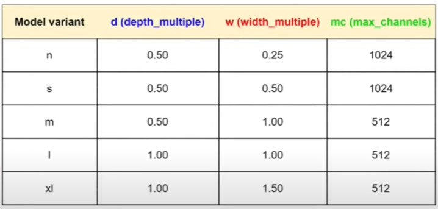

# 📊 Ý nghĩa các cột trong bảng cấu hình YOLOv11

## 1. Các cột trong bảng
- **Model variant**: Tên biến thể của mô hình YOLOv11 (`n, s, m, l, xl`).  
  - `n` = nano (rất nhẹ)  
  - `s` = small (nhỏ)  
  - `m` = medium (trung bình)  
  - `l` = large (lớn)  
  - `xl` = extra large (rất lớn)

- **d (depth\_multiple)**: Hệ số nhân cho **số lượng tầng** (layer/block) trong backbone.  
  - Ví dụ: `d = 0.5` → số tầng chỉ còn **một nửa** so với bản gốc.

- **w (width\_multiple)**: Hệ số nhân cho **số lượng kênh (channel)** trong mỗi tầng.  
  - Ví dụ: `w = 0.25` → số kênh giảm xuống **25%** so với bản gốc.

- **mc (max\_channels)**: Giới hạn **số kênh tối đa** trong backbone, không vượt quá giá trị này dù `w` có lớn đến đâu.

---

## 2. Ví dụ minh họa

- **YOLOv11-n**  
  - `depth_multiple = 0.50` → số tầng giảm **một nửa**  
  - `width_multiple = 0.25` → số kênh giảm còn **25%**  
  - `max_channels = 1024` → số kênh tối đa không vượt quá **1024**

- **YOLOv11-xl**  
  - `depth_multiple = 1.00` → số tầng giữ **nguyên bản gốc**  
  - `width_multiple = 1.50` → số kênh tăng lên **150%**  
  - `max_channels = 512` → số kênh tối đa giới hạn ở **512**

---

## 3. Tại sao cần nhiều biến thể?

- **Nhẹ (n, s):** tối ưu cho thiết bị di động, IoT, chạy nhanh với ít tài nguyên.  
- **Mạnh (m, l, xl):** dùng cho server, GPU, cần độ chính xác cao hơn.  

👉 Điều này cho phép người dùng **cân bằng giữa tốc độ và độ chính xác** theo nhu cầu thực tế.

---

## 4. Bảng cấu hình các biến thể YOLOv11

| Model variant | d (depth\_multiple) | w (width\_multiple) | mc (max\_channels) |
|---------------|----------------------|----------------------|---------------------|
| n             | 0.50                 | 0.25                 | 1024                |
| s             | 0.50                 | 0.50                 | 1024                |
| m             | 0.50                 | 1.00                 | 512                 |
| l             | 1.00                 | 1.00                 | 512                 |
| xl            | 1.00                 | 1.50                 | 512                 |

---

# ✅ Tóm tắt

- `depth_multiple (d)` → điều chỉnh **số tầng**.  
- `width_multiple (w)` → điều chỉnh **số kênh**.  
- `max_channels (mc)` → đặt **giới hạn kênh tối đa**.  
- `n, s, m, l, xl` → các biến thể mô hình cho **thiết bị khác nhau**, từ nhẹ đến mạnh.
